# Linux Detailed Pictorial Install Guide

If you are on a Linux computer, this guide has a lot of detailed instructions and screenshots that can be referenced when using this script. This guide has screenshots for Debian and Red Hat based distros (Ubuntu and Fedora, for example).

## Step 1: Install Python 3

If you're running Ubuntu or Fedora, you probably already have Python 3 installed. To verify this, open up a terminal window, and run `which python3` like so:

Ubuntu | Fedora
:----:|:----:
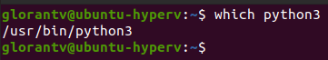 | 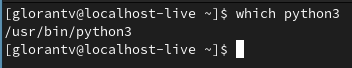

If you get a path to `python3`, you're good to move on to the next step. If not, you can install Python 3 by running these commands:

- For Ubuntu: `sudo apt-get install python3`
- For Fedora: `sudo dnf install python3`

## Step 2: Install Pip3

Pip is the official package manager for Python, and you'll need it to install the script's dependencies.

#### For Ubuntu

In your terminal window, run these commands: 
- `sudo apt-get update`
- `sudo apt-get install python3-pip`

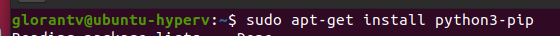

#### For Fedora

In your terminal window, run these commands:
- `sudo dnf update`
- `sudo dnf install python3-pip`

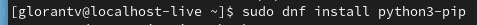

## Step 3: Install Python packages

Now you'll need to install the script's dependencies. Still in your terminal window, run these commands (these commands are the same for every distro):

- `pip3 install json5`
- `pip3 install pillow`
- `pip3 install argparse`

Ubuntu | Fedora
:----:|:----:
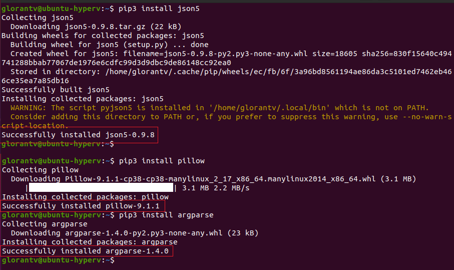 | 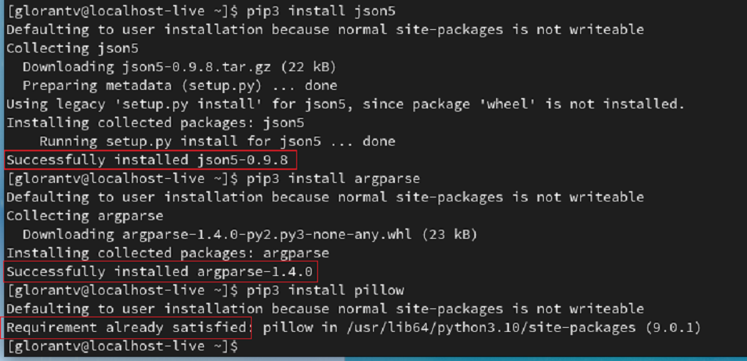

If you see `Successfully installed [...]` all three times, you can move on to the next step. (Of course if it's already installed that's fine as well)

## Step 4: Download the script code

You will want to download the script code directly from GitHub.

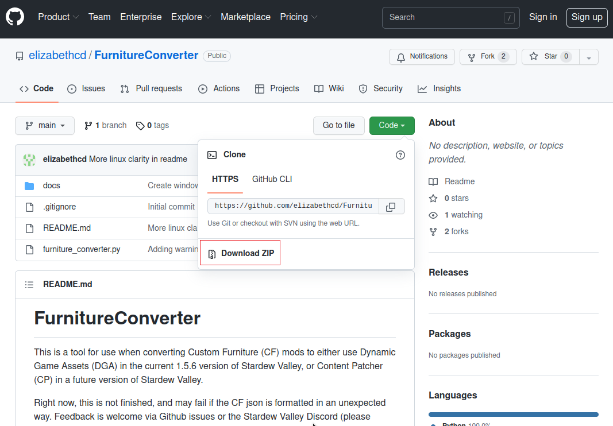

Once it is downloaded, you'll need to unzip the folder. To do this, right-click the downloaded file, and choose `Extract here`

Ubuntu | Fedora
:----:|:----:
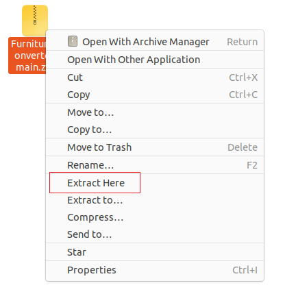 | 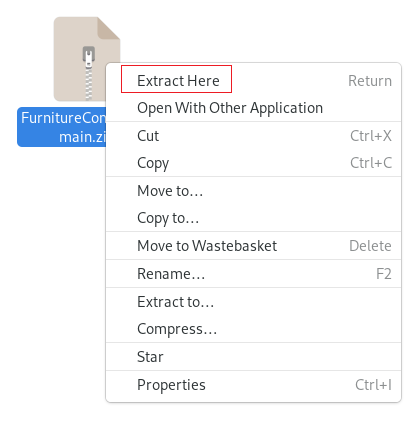

## Step 5: Place mod inside the script folder

For whatever mod you're interested in converting, start by moving it to the script folder.

Ubuntu | Fedora
:----:|:----:
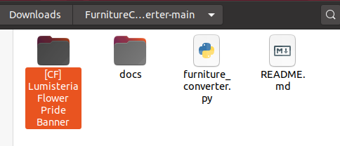 | 

After that, rename the folder name to original.

Ubuntu | Fedora
:----:|:----:
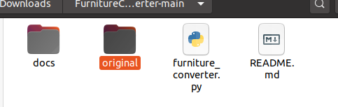 | 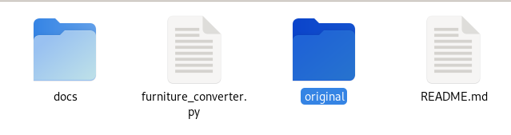

## Step 6: Run the script

Now you're ready to run the script. You'll need to open a terminal in the script's folder, either by right-clicking and choosing `Open in Terminal`

Ubuntu | Fedora
:----:|:----:
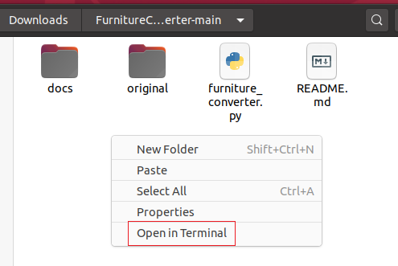 | 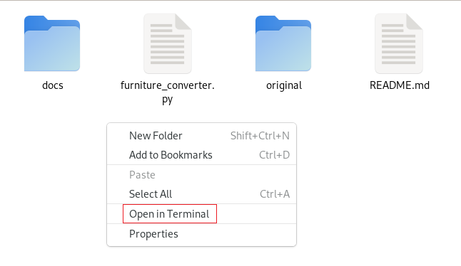

Or, by changing the directory in your already open window with `cd`. Assuming you're working in your Downloads folder, that command looks like this:

Ubuntu | Fedora
:----:|:----:
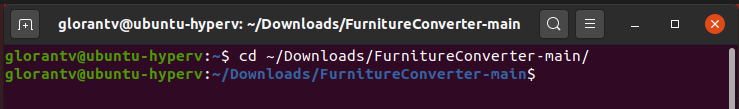 | 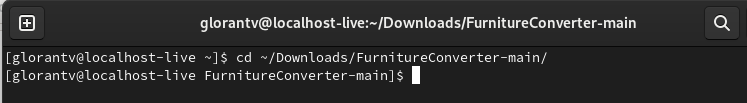

Once you have a terminal window open and the script folder is the active folder, you can then run the script. 

Type `python3 furniture_converter.py --modName SOMENAMEHERE` but with `SOMENAMEHERE` swapped out for a descriptive string into terminal and hit return
  * Putting `--modName SOMENAMEHERE` in is required. 
  * Putting `--modAuthor MODAUTHORNAME` is optional, but recommended if there's anything weird in the author field
  * Putting `--sellAt SHOPNAME` is optional, and adds a json to the DGA mod that sells all the furniture at a specified store. The options for the store names are here: https://github.com/spacechase0/StardewValleyMods/blob/develop/DynamicGameAssets/docs/author-guide.md#valid-shop-ids-for-vanilla and putting in something that isn't there will either throw an error when the mod is loaded or just silently not work, I'm not sure which.

Here's an example of what running the script looks like (with success being shown by the lack of error message). If you get an error message, please take a screenshot and ping me on Discord with a link to the furniture pack you are converting.

Ubuntu | Fedora
:----:|:----:
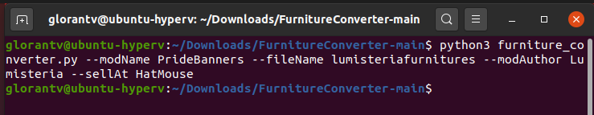 | 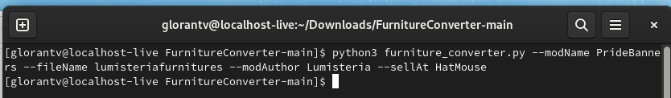

## Step 7: Use the mod

You can find the converted mod inside the script folder, and you can move it to your Mods folder just like any other mod. 

Ubuntu | Fedora
:----:|:----:
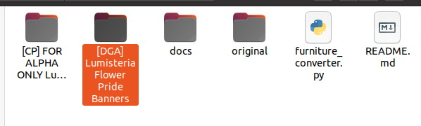 | 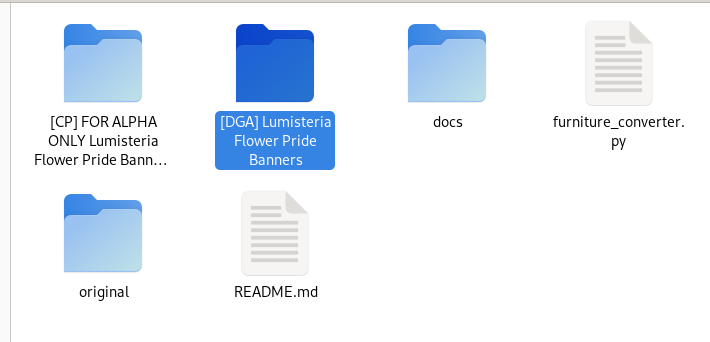
